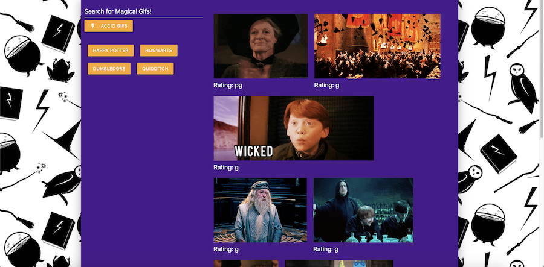

# GifTastic

A dynamic gif search web page powered by the Giphy API. The site was built using JavaScript, jQuery, HTML, CSS, and the Materialize framework.

Users can search for gifs in the top left-hand corner. This will create a clickable button containing the search term they entered. Once the button is clicked, matching gif results will be displayed on the right side of the screen. These gifs can be paused and re-started by clicking on them.

Visit the deployed site at: [Gif Magic!](https://michelle-88.github.io/GifTastic/)

